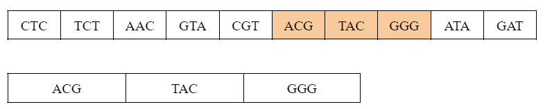
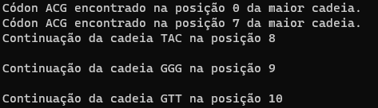

# Exercício 3 de Lista

### **Problema**
---

- Elabore um programa que receba uma cadeias de DNA. Cada posição da cadeia deve conter um códon, ou seja, uma triade de nucleotídeos → T, A, G, C. Feito isso, leia de um arquivo uma sequência de nucleotídios e tente identificar a maior cadeia da lista que e relaciona a essa entrada.

---

### **Solução**
---

O problema a ser resolvido consiste em achar em uma lista de cadeias de nucleotídeos, uma sublista que possua, ou não, os mesmos <em>códons</em> que a aquela. A imagem abaixo pode demonstrar melhor esta comparação a ser resolvida. A cadeia de cima é a primeira entrada, a que deve se buscar os nucleotídeos mostrados na cadeia menor abaixo.

 

A entrada dessas cadeias são feitas por meio de dois arquivos <em>'.txt'</em>, <em>cadeia</em> e <em>subcadeia</em>, que deve ser inserido sem separar os caracteres e em maiúsculo (i.e., ACGTGGCTCTCTAACGTACGTACGTACGGGGTTATATTCGAT). Feito isso têm-se duas listas, a maior lista chamada de <em><code>listaCadeia</em></code> e a menor de <em><code>listaSubCadeia</em></code>. 
A função que detém a lógica do programa é a <em><code>comparaCadeia</em></code>, dentro dela há três loops. 
O loop mais externo percorre toda a lista menor, o segundo percorre toda a lista maior comparando seus códons com os da lista menor utilizando a função <code>strcmp</code>, e o terceiro compara as próximas posições da cadeia caso fosse encontrado o primeiro códon da sequência da cadeia. 
O código foi pensado inicialmente com a solução sequencial ordenada, porém, há conhecimento de sua verdadeira solução que tornaria o exercício feito de maneira correta. Para que meu algoritmo encontre a cadeia desejada deve-se têr-la em ordem dentro da cadeia maior, caso contrário apresentará erros. Após inúmeras tentativas não foi possível tornar meu programa a solução correta. Segue abaixo exemplo de entrada e saída do código:

### **Entrada**
---
<table border="1">
    <tr>
        <td>ACG</td>
        <td>TGG</td>
        <td>CTC</td>
        <td>TCT</td>
        <td>AAC</td>
        <td>GTA</td>
        <td>CGT</td>
        <td>ACG</td>
        <td>TAC</td>
        <td>GGG</td>
        <td>GTT</td>
        <td>ATA</td>
        <td>TTC</td>
        <td>GAT</td>
    </tr>
</table>

<table border="1">
    <tr>
        <td>ACG</td>
        <td>TAC</td>
        <td>GGG</td>
        <td>GTT</td>
    </tr>
</table>

---
### **Saída**

---
 

---
# Compilação e Execução

O código apresentado possui um arquivo Makefile que realiza todo o procedimento de compilação e execução. Para tanto, temos as seguintes diretrizes de execução:

| Comando                |  Função                                                                                           |                     
| -----------------------| ------------------------------------------------------------------------------------------------- |
|  `make clean`          | Apaga a última compilação realizada contida na pasta build                                        |
|  `make`                | Executa a compilação do programa utilizando o gcc, e o resultado vai para a pasta build           |
|  `make run`            | Executa o programa da pasta build após a realização da compilação                                 |